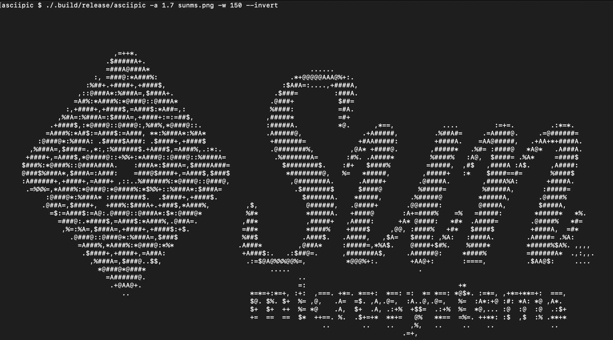

# asciipic

A utility for generating ASCII versions of image files.  

This was a fun swift project to learn a little about `NSImage`/`CGImage` on macos, but then I reimplemented it in Java.  The swift version is also in this repo.

I've made other versions of this program in scala and go, I think.  They live somewhere on my github account (most likely in the `small_programs` repos).

## Example

A screenshot:

## Usage

    Usage: asciipic [options] filename
    
    --aspectRatio | -a  <Double>
       the aspect ratio of your text font (default: 1.5)
    --width | -w  <Int>
       the desired width of the output (default: 72)
    --invert
       invert the brightness (can make some images look nicer)
    --help
       prints this help text

